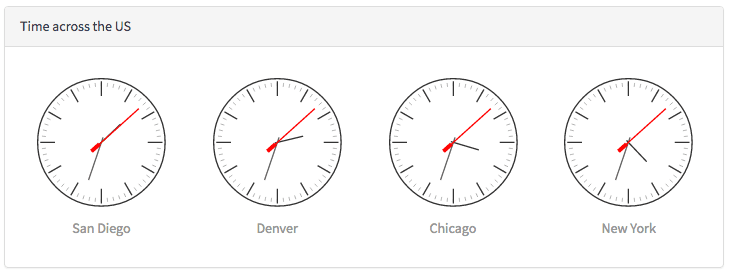

# Embedded Widgets

## \<sp-widget />
You can embed any widget inside of your widget’s [HTML template](widget_html.md) using the `sp-widget` directive. This directive requires a complete widget model which you can get using [spUtil.get()](#client-side) on the client or [$sp.getWidget](#server-side) in the [server script](/widget_server_script.md). The basic usage looks like this:

HTML Template  

```html
<sp-widget widget="c.myClockWidget"></sp-widget>
```   
<br />
Client Script

```javascript
function(spUtil) {
	var c = this;
	spUtil.get("widget-cool-clock").then(function(response) {
			c.myClockWidget = response;
	});
}
```

Examples
------

1. [Embed a widget using client script](#embedding_with_client_script)
2. [Embed a widget using server script](#embedding_with_server_script)
3. [Providing options to an embedded widget](#embedding_with_options)

#### <a name="embedding_with_client_script" href="#embedding_with_client_script">#</a> Embedding a widget using client script

This example will show you how to create a new widget and test page, and how to embed the cool clock widget in a bootstrap panel.

1. First go to the widget editor: /sp_config?id=widget_editor

2. Click "Create a new widget" and use the following values  
   **Widget Name:** Embedded clock  
   **Widget Id:** embedded_clock  
   **Create a test page:** True  
   **Page Id:** embedded_clock  
   
   
3. Click **Submit**
4. Now, copy the following code blocks into your new widget:


HTML Template

```html
<div class="my-clock">
	<div class="panel panel-default ">
		<div class="panel-heading">Time in San Diego</div>
		<div class="panel-body">
			<sp-widget widget="c.myClockWidget"></sp-widget>
		</div>
	</div>
</div>
```
<br />
Client Script

```javascript
function(spUtil) {
	var c = this;
	spUtil.get("widget-cool-clock").then(function(response) {
			c.myClockWidget = response;
	});
}
```
<br />
CSS  

```css
.my-clock {
	margin: 25px;
	width: 300px;
	height: 300px;
}
```
<br />
Result <br />
In a new browser window go to: /$sp.do?id=embedded_clock  


<br/>
#### <a name="embedding_with_server_script" href="#embedding_with_server_script">#</a> Embedding a widget using server script

Embedding a widget via server script is just as easy as embedding one via your widget's client script controller. 

Use the widget you created in the first example, but replace the contents with the following code blocks:

HTML Template

```html
<div class="my-clock">
    <div class="panel panel-default ">
        <div class="panel-heading">Time in San Diego</div>
        <div class="panel-body">
            <sp-widget widget="c.data.myClockWidget"></sp-widget>
        </div>
    </div>
</div>
```
<br/>
Client Script

```javascript
function() {
	// nothing to do here...
}
```
<br/>
Server Script

```javascript
(function() {
	data.myClockWidget = $sp.getWidget("widget-cool-clock", {});
})();
```
<br />
Result <br />
In a new browser window go to: /$sp.do?id=embedded_clock  


<br/>
#### <a name="embedding_with_options" href="#embedding_with_options">#</a> Providing options to an embedded widget

Building on top of the previous example, now you will see how to embed the cool clock widget with custom options. Each instance of the clock is provided a different timezone and title. 

> To see what options are configurable in the cool clock widget, open it in the widget editor. It uses the options object for the title, second hand color, and the timezone. This screenshot shows you where they're hiding.

> 

#### Part 1
Use the following code to provide the c_color option when you fetch the widget:

Server Script

```javascript
(function() {
	data.myClockWidget = $sp.getWidget("widget-cool-clock", {c_color: "gold"});
})();
```
<br />
Result<br/>
In a new browser window go to: /$sp.do?id=embedded_clock


#### Part 2
What's more interesting than embedding one widget with custom options? How about four?!
To really see the power of options and embedded widgets this example will demonstrate how to embed several clocks with different timezones and titles.

Edit the "Embedded clock" widget and replace with the following code blocks:


HTML

```html
<div class="panel panel-default">
  <div class="panel-heading">Time across the US</div>
  <div class="panel-body">
    <div class="row">
      <div class="col-sm-3" ng-repeat="myClock in c.data.clocks">
        <sp-widget widget="myClock"></sp-widget>
      </div>
    </div>
  </div>
</div>
```
<br/>
CSS

```css
.panel {
	margin-top: 10px;
}
```
<br />
Client Script

```javascript
function() {
	// nothing to do here...
}
```
<br />
Server Script

```javascript
(function() {
	var options = [
		{zone: "America/Los_Angeles", title: "San Diego"},
		{zone: "America/Denver", title: "Denver"},
		{zone: "America/Chicago", title: "Chicago"},
		{zone: "America/New_York", title: "New York"}
	];
	
	data.clocks = [];
	for (var i in options) {
		data.clocks.push($sp.getWidget("widget-cool-clock", options[i]));
	}
})();
```
<br />
Result  
In a new browser window go to: /$sp.do?id=embedded_clock  

Each instance of the clock widget has a different timezone and title.




<br/><br/>
## API Reference

### Client Side
#### spUtil.get() - Get a widget model via client script

```javascript
spUtil.get("widget-sc-cat-item", {sys_id: "your_catalog_item_sys_id"}).then(function(response) {
	c.catalogItemWidget = response;
});
```
**Parameters**

- (_string_) widget\_id  
   Can be a widget_id or widget sys_id.
- (_object_) data  
   An object to post to the widget's server script. Refer to this object as **input** in your server script.

**Callback**  

The callback function is called when the widget model is ready. The response object contains the full widget model.

<br/><br/>

### Server Side
#### $sp.getWidget() - Get a widget model via server script

```javascript
data.catalogItemWidget = $sp.getWidget("widget-sc-cat-item", {sys_id: "your_catalog_item_sys_id"});
```
**Parameters**  

- (*string*) widget\_id  
   Can be a widget_id or widget sys_id.  
- (*object*) options  
   An object to pass to the widget's server script. Refer to this object as **options** in your server script.

<br/><br/>
#### Widget Model in depth

The widget model contains all of the client-side parts of a widget needed to create an angular directive. The HTML template, client script, and link function are loaded just as they are in the sp_widget record. The data property is the result of the widget's server script execution. Anything that you put on the data object on the server is available in the data object on the client.

Here is a detailed look at some of the fields in the widget model: 

| Property name | Type | Description |
| ------------- | ---- | ----------- |
| client_script | string | The widget's client script field |
| css | string | The compiled css output from the widget's sass field |
| data | object | The data object containing all of the keys and values added to it in the widget's server script |
| dependencies | array | A collection of javascript libraries to load before the widget executes |
| options | object | The options used to initialize the widget |
| template | string | The widget's HTML Template field |
