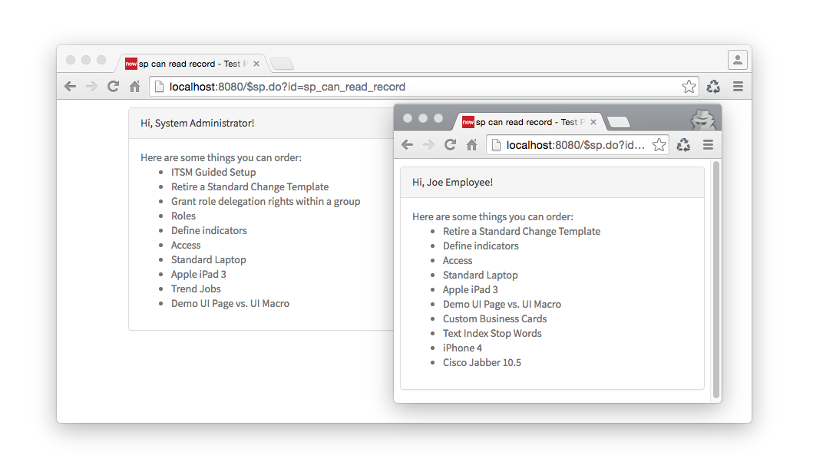

### $sp API
Service Portal provides a set of convenience methods found on the global `$sp` object, which is available in any widget server script.

| Method | Description |
| :------ | :----------- |
| [canReadRecord](#canReadRecord)(Mixed, *opt String*): boolean | Returns true if the user can read the specified GlideRecord. |
| [getCatalogItem](#getCatalogItem)(String): Object | Returns a model and view model for a sc_cat_item or sc_cat_item_guide. |
| [getDisplayValue](#getDisplayValue)(String): String | Like [getValue](#getValue) except that it returns the display value. |
| [getField](#getField)(GlideRecord, String): Object | Returns {label, value, displayValue, type} for a given field on a GlideRecord. |
| [getFields](#getFields)(GlideRecord, String): Array | Like getField Checks the specified field names, and returns a comma seperated list of valid names. |
| [getFieldsObject](#getFieldsObject)(GlideRecord, String) | Checks the specified field names, and returns an object containing the valid names. |
| [getForm](#getForm)(String table, String sys_id, /*Optional String*/ encodedQuery, /*Optional String*/ view)|Returns the form|
| [getListColumns](#getListColumns)(String tableName, String view): |Returns a list of the specified table's columns in the specified view|
| [getMenuItems](#getMenuItems)(String sys_id): Array | Returns the menu items for the specified instance |
| [getMenuHREF](#getMenuHREF)(GlideRecord): String | Returns the (?id=) portion of the URL based on the sp_menu type. |
| [getParameter](#getParameter)(String): String | Returns the value of a given key from the query string or post body. |
| [getPortalRecord](#getPortalRecord)(): GlideRecord  | Returns the portal's GlideRecord. |
| [getRecord](#getRecord)(): Glide | Returns the GlideRecord for the current sp_instance\*. Returns null if the widget is embedded by another widget. |
| [getRecordDisplayValues](#getRecordDisplayValues) (Object, GlideRecord, String): void | Copies display values for the specified field names from a GlideRecord into the data parameter. |
| [getRecordElements](#getRecordElements)(Object, GlideRecord, String): void | Copies the value and display value for the specified field names from a GlideRecord into the data parameter. |
| [getRecordValues](#getRecordValues) (Object, GlideRecord, String): void | Copies values for the specified field names from a GlideRecord into the data parameter. |
| getStream(String, String): Object | Get the activity stream for a record. |
| getUserInitials() | Returns the user's initials as a string. |
| [getValue](#getValue)(String): Object | Returns a value from an object or GlideRecord in this order: <br/>1. The http request<br/> 2. The widget's sp_instance* record<br/>3. The current sp_portal record<br />or returns null |
| [getValues](#getValues)(Object, String): void | Copies values from the request or instance into the data parameter. |
| [getValues](#getValues)(Object): void | Copies values from the widget's sp_instance GlideRecord into the data parameter. |
| [getWidget](#getWidget)(String, Object): Object | Returns a widget model for embedding a widget inside another widget. |

<a name="getPortalRecord"></a> $sp.getPortalRecord()
------
Useful for getting the current portal context. It returns the sp_portal GlideRecord if there is one.

- $sp.getPortalRecord( )  
	- **Parameters**
		- None  
	- **Returns**
		- (*GlideRecord*) The sp_portal record of the current portal context or null.

Server Script

```javascript
(function() {
	var portalGr = $sp.getPortalRecord();
	data.logo = portalGr.getDisplayValue("logo");
	data.homepage = portalGr.getDisplayValue("homepage.id");
})();
```
<br />
HTML Template

```html
<div>
	
	<a href="?id={{::c.data.homepage}}">Click here to go home</a>
</div>
```
<br/>
Result


<a name="getWidget"></a> $sp.getWidget()
-----
Gets a widget by id or sys_id, executes that widget's server script using the provided options, then returns the widget model.

- $sp.getWidget( widget_id, options ): Object
	- **Parameters**
		- (*String*) widget\_id  
		Can be a widget_id or widget sys_id.  
		- (*Object*) options  
		An object to pass to the widget's server script. Refer to this object as **options** in your server script.
	- **Returns**  
		- (*Object*) A widget model to be used with \<sp-widget />.

Server Script

```javascript
data.myWidget = $sp.getWidget('widget_id', {p1: param1, p2: param2});
```
<br />
HTML Template

```html
<sp-widget widget="c.data.myWidget"></sp-widget>
```
<br />
For more information and examples refer to the [Embedded Widgets guide](/widget_embedded.md).

<a name="canReadRecord"></a> $sp.canReadRecord()
-----
Useful for quickly determining if a record is valid and if the logged-in user has access to it. 

> If the record type is kb_knowledge, sc_cat_item, or sc_category it also checks if the user can view that item.

- $sp.canReadRecord( gr ): Boolean
	- **Parameters**
		- (*GlideRecord*) gr  
		 A glide record
	- **Returns**
		- (*Boolean*) True if the record is valid and readable 
- $sp.canReadRecord( table, sys_id ): Boolean
	- **Parameters**
		- (*String*) table  
		 A table name to query.
		- (*String*) sys_id  
		 The record sys_id to query.
	- **Returns**
		- (*Boolean*) True is the record is valid and readable

Server Script

```javascript
data.items = [];
data.userName = gs.getUserDisplayName();
var gr = new GlideRecord("sc_cat_item");
gr.query();
while(gr.next() && data.items.length < 10) {
	if ($sp.canReadRecord(gr)) {
		data.items.push(gr.getDisplayValue("name"));
	}
}
```
<br />
HTML Template

```html
<div class="panel panel-default">
	<div class="panel-heading">Hi, {{c.data.userName}}!</div>
	<div class="panel-body">
		Here are some things you can order:
		<ul><li ng-repeat="item in c.data.items">{{item}}</li></ul>
	</div>
</div>
```
<br/>
Result


> Notice how the list of items is different based on the logged in user